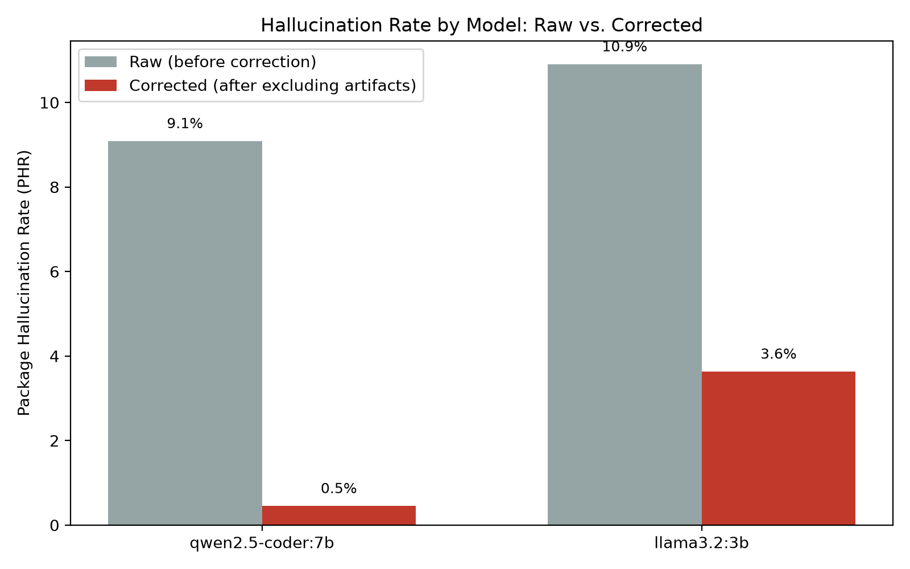

# AI Hallucination -> Slopsquat Detector

[](https://github.com/Thawne11/AI-Hallucination-Slopsquat-Detector/actions/workflows/ci.yml)

**Question:** when an LLM writes code and imports a package, does that package
actually exist?

Sometimes not. LLMs occasionally hallucinate plausible-sounding but
nonexistent package names — a `retry-async-http` that isn't on PyPI, a
`ws-reconnect` that isn't on npm. Researchers have shown this happens
consistently enough that it has a name: **slopsquatting**. An attacker
enumerates the package names LLMs commonly hallucinate, registers them on
PyPI/npm with malicious code inside, and waits for developers to copy-paste
AI-generated code (or let an AI coding agent run `pip install` /
`npm install` directly) without checking the name is real.

This turns a pure reliability problem (the model made something up) into a
supply-chain attack surface.

This repo has two tools:

1. **`slopsquat-scan`** — an installable CLI that checks a codebase's
   *declared* dependencies (`requirements.txt`, `package.json`, etc.)
   against the real registries. Point it at a local project or a remote
   repo. Answers: does this codebase already have a phantom dependency
   in it?
2. **The generation tester** (`run.py` / `analyze.py` / `rerun_analyze.py`)
   — asks an LLM to write code and checks what it imports. Answers: how
   often does a model invent one in the first place?

**Neither tool registers, publishes, or claims any of the flagged package
names.** They only detect and report — actually squatting a flagged name,
even "to prove the point," would itself be the attack this project is about.

## `slopsquat-scan`: the dependency-scanning CLI

```bash
pip install -e .

slopsquat-scan scan .                                  # the project you're in
slopsquat-scan scan ./some/project                     # any local directory
slopsquat-scan scan https://github.com/psf/requests    # a remote repo
slopsquat-scan scan . --include-imports                # + names imported in source
slopsquat-scan scan . --risk                           # + risk-score every dependency
slopsquat-scan check loadsh --ecosystem javascript --explain   # + evidence behind the score
slopsquat-scan check loadsh --ecosystem javascript     # score one package name
slopsquat-scan resolve cv2 sklearn                     # what do these actually install?
slopsquat-scan batch repos_baseline.txt --out-dir scan_results/baseline
```

- `scan <target>` — `<target>` is a local path *or* a repo URL, detected
  automatically. Local paths are read in place; remote URLs are shallow-cloned
  (`--depth 1`) to a temp directory first. Prints a readable summary; pass
  `--json` for the full report, `--out FILE` to save it.
- `check <name> [--ecosystem python|javascript]` — risk-score a single
  package name without needing a project to scan. See "Risk scoring" below.
- `batch <targets-file> [--out-dir DIR]` — the same, for a list of targets,
  one JSON report each.
- `resolve <import>...` — show which distribution a Python import name
  actually comes from. See "Import → Distribution resolution" below.

Scanning a **local** directory is the case that matters most in practice: the
risk lands the moment you paste AI-generated code and install what it
imported, which is before anything is committed or pushed. Requiring a
published repo URL would mean the tool could only inspect other people's
code, never the working copy in front of you.

```
$ slopsquat-scan scan ./my-project
Target:                ./my-project
Manifests found:       2
Dependencies checked:  5

2 phantom dependencies:
  auto-retry-httpx  (python)      requirements.txt
  ws-reconnect-pro  (javascript)  apps/web/package.json
```

Exit codes are distinct so CI can tell the failure kinds apart -- `0` clean,
`1` a finding, `2` the scan itself failed (bad path, clone error).
Collapsing the last two would leave a pipeline unable to distinguish "your
dependencies are bad" from "the scanner could not run".

### Gating a build on risk

A phantom dependency always counts as a finding. Risk scores do not, unless
you ask them to:

```bash
slopsquat-scan scan . --fail-on high      # exit 1 if anything scores HIGH or worse
slopsquat-scan check some-pkg --fail-on medium
```

`--fail-on` takes `low`, `medium`, `high` or `critical`, and implies
`--risk`. Without it the risk section stays informational, so adding
scoring to an existing pipeline can't start failing it out from under you.

This was a genuine hole rather than a missing nicety. `scan --risk` would
report a package as HIGH or CRITICAL and still exit `0` -- meaning the
scoring engine, whose entire purpose is to flag packages that *do* exist and
are still dangerous, could not stop a single build. Distinct exit codes had
been added specifically so CI could gate on findings, and then a whole
finding category was added that bypassed them.

Phantom sits above `critical` in the ordering, so even `--fail-on critical`
cannot wave a nonexistent package through.

### Risk scoring: existence is binary, danger is not

A name that does **not** resolve is a loud, safe failure -- `pip install`
errors out and you notice. The genuinely dangerous case is a name that
**does** resolve, because an attacker already registered it. A status-code
check calls that one "fine".

`slopsquat-scan check <name>` scores a single package, and `scan --risk`
scores every dependency in a project:

```
$ slopsquat-scan check loadsh --ecosystem javascript
loadsh  [MEDIUM 40/100]  (javascript)
  - 1 edit away from 'lodash'  (+30)
  - a single maintainer  (+5)
  - 7,701 downloads last week  (+5)
```

`loadsh` is a **real, published npm package** and a live typosquat of
`lodash`. The existence check returns 200 for it. That is precisely the case
the binary tool was blind to.

Signals, all drawn from the registry record that `registry.py` was already
fetching and discarding:

| Signal | Why it matters |
|---|---|
| Typosquat distance | Transposition-aware edit distance to a very popular name |
| Package age | Slopsquat registrations are recent by construction |
| Release count | A lone `0.0.1` is not an established library |
| Repository link | Real projects link to source |
| Description | Squats are often blank or near-blank |
| Maintainer count | npm only |
| Weekly downloads | npm only |

Three rules the engine holds to, each enforced by tests:

1. **Explainable, never a bare number.** Every point carries a reason. "Risk
   78" cannot be acted on or argued with; "3 days old, one release, no
   repository link" can.
2. **An unavailable signal is not a bad signal.** npm publishes free download
   counts; PyPI does not (pypistats returns HTTP 429 on a single
   unauthenticated call). Scoring "unknown" as "suspicious" would add points
   to every Python package in every scan, so missing signals contribute
   nothing and are reported as unavailable.
3. **Triage, not proof.** A high score means a human should look, never that
   something is malware.

A non-existent package is reported as its own `PHANTOM` tier rather than
folded into the numeric scale, because it is a different kind of problem:
harmless today, since the install fails, but an unclaimed name that an
attacker can register tomorrow -- at which point it silently becomes the
dangerous case above.

### Explainable risk assessment: score, factors, confidence

Every risk verdict answers two separate questions.

**Risk** — how suspicious does this package look? **Confidence** — how much
evidence is that judgement standing on? They are independent, and the
independence is the point:

```
$ slopsquat-scan check requests
requests  [LOW 0/100]  (python)  confidence 70%
  - not scored, unavailable for this registry: maintainers, downloads

$ slopsquat-scan check loadsh --ecosystem javascript
loadsh  [MEDIUM 40/100]  (javascript)  confidence 100%
  +30  1 edit away from 'lodash'
  +5   a single maintainer
  +5   5,410 downloads last week
      --------------------
  40  total
```

`requests` is the *safer* package and carries the *lower* confidence — PyPI
publishes no free download counts or usable maintainer data, so there is
genuinely less to go on. A single number could not have told you that.

Every point carries the reason the scoring engine used to award it; the
factors are the engine's own output, not a narration written afterwards.
The totals reconcile with the score, and where the 100-point cap bites, the
breakdown says `(capped from 120)` rather than printing a total that
silently disagrees with the lines above it.

`--explain` adds the evidence behind the confidence figure:

```
$ slopsquat-scan check loadsh --ecosystem javascript --explain
...
Evidence quality (100%):
  + registry answered  (40 pts)
  + release history available  (15 pts)
  + download statistics available  (15 pts)
  + maintainer information available  (15 pts)
  + repository link present  (10 pts)
  + description present  (5 pts)
```

**Confidence is evidence completeness, not probability of correctness.**
There is no calibration data behind this tool, so a number implying "93%
chance this verdict is right" would be an unearned claim. The weights sum
to 100, the calculation is a sum, and it is documented in `risk.py`.

Identity uncertainty is subtracted separately: if a package was reached
through a source import whose distribution could not be pinned down
(`unresolved` or `ambiguous`), confidence drops, because the doubt is about
*which* package is being judged rather than about the package itself. That
never raises the risk score — not knowing what something is isn't evidence
that it's bad.

#### PHANTOM, and the outage that used to look like one

A definitive "no such package" scores **95%** confidence: the one piece of
evidence that matters is present. Not 100 — registries go briefly
inconsistent, and an unclaimed name can be registered a minute after the
check.

A registry that *could not be reached* is a different outcome entirely:

```
2 unverified packages (registry unreachable):
  requests  (python)  requirements.txt
  flask     (python)  requirements.txt

Existence could not be checked -- this is not a finding about these
packages, and the scan is incomplete.
```

Tier `UNVERIFIED`, confidence 0, **exit 2** (scan incomplete), and never
`PHANTOM`. `UNVERIFIED` also sits outside the severity scale entirely, so no
`--fail-on` threshold can be satisfied by it — including `--fail-on low`.

This mattered more than it sounds. Before this change every registry call
was unguarded, so an outage raised an unhandled exception — and Python exits
1 on an unhandled exception, which is this tool's *finding* code. A DNS blip
was indistinguishable from "your dependencies are bad", which is precisely
what the separate exit-2 code exists to prevent.

### Using it in your own project

**As a pre-commit hook** — add to `.pre-commit-config.yaml`:

```yaml
repos:
  - repo: https://github.com/Thawne11/AI-Hallucination-Slopsquat-Detector
    rev: master        # pin to a release tag once one is cut
    hooks:
      - id: slopsquat-scan          # every dependency resolves (fast)
      - id: slopsquat-scan-risk     # + fails on high-risk (pre-push stage)
```

Two hooks because they cost very differently. The default only checks that
declared dependencies resolve -- a handful of requests, fast enough to sit
in front of every commit. The risk variant reads each package's full
registry record, so it's scoped to `pre-push`.

**As a GitHub Action** — add a step:

```yaml
- uses: Thawne11/AI-Hallucination-Slopsquat-Detector@master
  with:
    risk: "true"
    fail-on: high
```

Inputs: `path` (default `.`), `risk`, `fail-on`, `python-version`.

This repo's own CI runs that action against this repo (the `self-scan` job),
so one job proves both that our declared dependencies are clean and that the
action actually works for anyone else. An action nobody has ever run is just
a YAML file.

**What gets read.** By default, manifest files only:
- Python: `requirements.txt`, `pyproject.toml` (PEP 621 `[project]` and
  Poetry `[tool.poetry]`), `setup.py` (`install_requires=[...]`)
- JS/Node: `package.json` (`dependencies` + `devDependencies`)

With `--include-imports`, also every `import` / `require` in source
(`.py`, `.js`, `.mjs`, `.cjs`, `.jsx`, `.ts`, `.tsx`).

See `scanner/manifest_parser.py` and `scanner/repo_scan.py`.

### `--include-imports`: catching it before it reaches a manifest

Manifest-only scanning has a blind spot, and it sits exactly where this
project claims to be useful. A working copy right after AI-generated code
was pasted in:

```
$ cat main.py
import requests
import auto_retry_httpx
from ws_reconnect_pro import Client

$ slopsquat-scan scan .
Dependencies checked:  1
No phantom dependencies found.          # ← both invented names invisible
```

Nothing is wrong with the manifest, because neither name has reached it
yet. That comes later, if it comes at all.

```
$ slopsquat-scan scan . --include-imports
Manifests found:       1
Source files scanned:  3
Dependencies checked:  3

2 phantom dependencies:
  auto_retry_httpx  (python)  main.py  [imported, not declared]
  ws_reconnect_pro  (python)  main.py  [imported, not declared]
```

Findings carry an `origin` of `manifest` or `import`, because they aren't
equivalent: something declared in a manifest is on its way to being
installed, while an imported-but-undeclared name is the earlier and more
urgent signal — it's what a fresh paste looks like before anyone has run
`pip install`.

**Why this was a scope change, not a missing feature.** The original
decision was "manifest files, not full source scan," reasoning that the
declared dependency is what actually gets installed. That was correct *for
a tool that could only scan published repos* — in published code, anything
genuinely in use has usually reached a manifest. Local directory scanning
changed that premise, and the reasoning quietly went stale rather than ever
being wrong.

**Why it's opt-in.** Source imports are noisier than manifests, so the
high-precision default is left alone and this adds recall. The thing that
makes it usable at all is local-module suppression: Python resolves a bare
`import helpers` against the local directory, so a module the project
defines for itself isn't a registry dependency. Without that, the feature
would flag every internal module in the codebase. It's applied to Python
only and deliberately so — Node doesn't resolve bare specifiers locally, a
local file has to be required as `./foo`, so a same-named file there must
*not* suppress a genuine package reference. Both directions are pinned by
tests.

### Import → Distribution resolution

A Python module's importable name is not always the name you install:

| You write | You install |
|---|---|
| `import cv2` | `opencv-python` |
| `import sklearn` | `scikit-learn` |
| `import yaml` | `PyYAML` |
| `from PIL import Image` | `Pillow` |
| `import bs4` | `beautifulsoup4` |
| `import Crypto` | `pycryptodome` |

So checking an import name against PyPI asks the wrong question. Before this
layer existed, scanning a file importing six perfectly ordinary libraries
produced two false accusations:

```
3 phantom dependencies:
  yaml              (python)  app.py     <- actually PyYAML
  cv2               (python)  app.py     <- actually opencv-python
  auto_retry_httpx  (python)  app.py     <- genuinely invented
```

The three that *weren't* flagged — `sklearn`, `bs4`, `PIL` — passed for a
worse reason than the failures: they only resolve because someone happens to
have published shim distributions under those exact import names. The check
was relying on a coincidence, not on being right.

**How it resolves**, in order, stopping at the first layer that answers:

1. **Curated mapping** (`known_aliases.py`) — confidence 1.0. One dedicated
   module, so the mapping grows without touching scanner logic.
2. **Installed environment** — `importlib.metadata.packages_distributions()`,
   if the package happens to be installed where the scanner runs. Reads
   dist-info metadata; it never imports the package.
3. **Registry probe** — does a distribution of this exact name exist?
   Strong evidence but not proof it provides the module, so confidence 0.9.
4. **Give up honestly** — `unresolved`.

```bash
$ slopsquat-scan resolve cv2
IMPORT:       cv2
DISTRIBUTION: opencv-python
RESOLUTION:   VERIFIED
CONFIDENCE:   100%
SOURCE:       mapping

$ slopsquat-scan resolve sklearn yaml requests   # several at once
```

#### verified / unresolved / ambiguous

**`verified`** — mapped to a distribution, which is then checked and scored
by the existing risk engine exactly as before.

**`unresolved`** — no layer could map it. This is reported as its own
category, **not** as a phantom package:

```
1 unresolved import:
  auto_retry_httpx  (python)  app.py
                    no distribution of that name on the registry either

Not classified as phantom: failing to map an import is not proof that no
distribution provides it. Verify each before installing.
```

That wording is the point. "We could not determine what this installs" and
"no such distribution exists" are different claims, and only the second
would be evidence of a hallucinated package. An unresolved import still
**exits 1** — an invented name lands here, so treating it as clean would gut
the check — but it is never described as something the scanner did not
prove.

The report also distinguishes *absent* from *unasked*: if the registry
couldn't be reached, the line reads `registry could not be consulted`
instead. Without that, every offline run would look like a pile of
discoveries.

**`ambiguous`** — more than one distribution legitimately provides the
module. Never collapsed to a guess:

```
$ slopsquat-scan resolve slugify
DISTRIBUTION: AMBIGUOUS
CANDIDATES:
  - awesome-slugify
  - python-slugify
```

#### What it deliberately does not do

- **No fuzzy matching.** `reqests` never resolves to `requests`. Fuzzy
  similarity is how the *typosquat* signal works in `risk.py`, answering the
  opposite question — "is this suspiciously close to a popular name?" —
  and letting it feed identity resolution would launder the exact attack
  this project detects. Pinned by a test.
- **No installing or importing** a target package to find out what it
  provides.
- **No touching manifests.** `requirements.txt` already lists distribution
  names, so a line reading `cv2` means the distribution literally called
  `cv2`. Rewriting it to `opencv-python` would answer about a package the
  developer never asked for. Resolution applies to *source imports* only.
- **No touching JavaScript.** npm has no module/distribution split — an
  import specifier there is the package name — so JS behaviour is unchanged.

#### Extending the mapping

Add an entry to `KNOWN_PYTHON_ALIASES` in `known_aliases.py` (or
`AMBIGUOUS_PYTHON_IMPORTS` if several distributions provide it). Nothing
else needs to change. The mapping is deliberately incomplete and that is
safe: a missing entry degrades to `unresolved`, which is a prompt to check,
not an accusation.

### Two false-positive sources found and fixed while building this

Both of these showed up as real findings during development, on real repos,
and both turned out to be measurement bugs, not actual phantom dependencies.
Worth documenting because they're exactly the kind of thing that makes a
naive "check if the name exists" tool noisy in practice:

1. **Test fixtures.** `python-poetry/poetry`'s own test suite contains
   `pyproject.toml` fixtures with deliberately-fake dependency names (to
   test poetry's own error handling) — e.g. `tests/fixtures/invalid_pyproject/`.
   The scanner initially walked every file named `pyproject.toml` in the
   repo, fixtures included, and flagged 10 "phantom" packages that were
   never real dependencies of the project at all. Fixed by excluding
   `tests/`, `fixtures/`, `examples/`, and similar directories from the
   walk.
2. **Monorepo self-references.** In JS/Python monorepos, a package
   legitimately depends on a sibling package by name (`"@myorg/core": "*"`,
   or a Poetry `{path = "../sibling"}` dependency). That name won't resolve
   on the public registry because it was never meant to — it's resolved
   locally by the workspace tooling. Initially this looked like more
   phantom packages (`@dukkanify/core`, `manifest-shared`,
   `openbrain-memory`, ...). Fixed by collecting every package name the
   repo declares for *itself* across all its manifest files first, then
   excluding dependencies that match a locally-declared name.

Both fixes are in `scanner/manifest_parser.py` / `scanner/repo_scan.py`.
Tracked as [issue #2](https://github.com/Thawne11/AI-Hallucination-Slopsquat-Detector/issues/2)-adjacent
measurement caveats, since they're the same underlying lesson: an
existence-check is a blunt instrument, and needs real-world validation
before the numbers mean anything.

### Prevalence study: baseline vs. AI-assisted repos

Scanning only flagship, heavily-reviewed repos (React, Django, requests...)
would likely show 0% regardless of whether the risk is real — that's not a
meaningful test by itself. So this ran two groups:

- **Baseline (`repos_baseline.txt`, 8 repos)** — hand-picked, well-known,
  actively maintained Python/JS repos (`psf/requests`, `pallets/flask`,
  `tiangolo/fastapi`, `python-poetry/poetry`, `expressjs/express`,
  `axios/axios`, `lodash/lodash`, `chalk/chalk`). Control group.
- **AI-assisted (`repos_ai_assisted.txt`, 10 repos)** — discovered via
  `gh search commits` for real commit messages containing AI co-authorship
  signatures (`"Co-Authored-By: Claude"`, `"Generated with Claude Code"`),
  filtered to repos that actually have a manifest file. This is the group
  where an unreviewed AI-generated dependency line is more likely to have
  slipped through.

**Results: 0/8 baseline, 0/10 AI-assisted — 0% phantom-dependency
prevalence in both groups**, across 531 unique declared dependencies
checked. See `PREVALENCE_REPORT.md` and `prevalence_chart.png` for the full
breakdown (generated by `compile_prevalence.py`).

This is a small, honestly-reported null result, not a "the risk doesn't
exist" claim — 18 repos is a small sample, the AI-assisted group was found
via a narrow keyword search (real commit co-authorship trailers, which not
every AI-assisted commit includes), and published research on model output
directly (see below) puts real hallucination rates at single-digit
percentages, meaning a sample this size can easily land at 0% by chance.
What this run does demonstrate: the tool works end-to-end against real
repos, it survived two rounds of "wait, is that actually a false positive?"
scrutiny, and it's now something you can point at any repo yourself.

## The generation tester (original tool)

1. Sends a fixed set of realistic coding prompts to Claude (`prompts.py`),
   sampled multiple times each.
2. Parses the generated code's imports (Python via `ast`, JS via
   `require`/`import` regexes) — see `extractor.py`.
3. Checks every extracted package name against the real PyPI / npm registry
   APIs — see `registry.py`.
4. Flags any package that returns a 404 as **hallucinated**, and reports how
   often each type of task produces one.
5. Renders a bar chart (`chart.py`) of hallucination rate by task.

There are three analysis modes:

- **`analyze.py`** — one sample per prompt. Quick breadth check.
- **`rerun_analyze.py`** — follows the methodology used in published
  slopsquatting research ([arXiv 2501.19012](https://arxiv.org/pdf/2501.19012)):
  rerun the same prompt multiple times and measure two separate rates:
  - **PHR (Package Hallucination Rate)**: % of reruns containing at least
    one hallucinated package.
  - **RHR (Repeated Hallucination Rate)**: for any hallucinated name that
    does show up, what fraction of reruns it recurs in. This is the number
    that actually matters for attackers — a name that appears once isn't
    worth squatting, but one a model reliably invents across most reruns is
    predictable enough to profitably pre-register.
- **`multi_model_rerun.py`** — the same PHR/RHR methodology, but across
  multiple *models* instead of one. See "Cross-model comparison" below.

`prompts.py` started at 8 prompts (used for the single-model results below)
and was expanded to 22 for the multi-model pilot, leaning further into
niche/uncommon library territory since novel tasks are more likely to
induce hallucination than well-trodden ones.

### Running it

Two ways to generate the code samples:

**Automated**, via the Anthropic API (needs a paid key):
```bash
python3 -m venv venv && source venv/bin/activate
pip install -r requirements.txt
# add your key to .env: ANTHROPIC_API_KEY=sk-...
python3 run.py
```

**Manual**, via the free Claude.ai chat — paste each prompt in `prompts.py`
into a fresh chat, save the reply as `responses/<prompt_id>.txt`, then:
```bash
python3 analyze.py
```

Either way, then run `python3 chart.py` to render `hallucination_rate.png`.

For the PHR/RHR rerun methodology, save `N` responses per prompt as
`responses_rerun/<prompt_id>_<n>.txt` (n = 1..5), then:
```bash
python3 rerun_analyze.py
```

### Results (this run)

Tested against Claude Sonnet 5 (via Claude.ai, manual mode) on 2026-08-11,
one sample per prompt across 8 tasks:

| Prompt | Packages imported | Hallucinated |
|---|---|---|
| py-pdf-tables | `pdfplumber`, `pandas` | none |
| py-retry-backoff | `requests` | none |
| py-jwt-refresh | `requests` | none |
| py-s3-multipart | `boto3`, `botocore` | none |
| py-fuzzy-dedupe | *(stdlib only)* | none |
| js-rate-limit | *(no external deps)* | none |
| js-csv-stream | *(Node builtins only)* | none |
| js-websocket-reconnect | `ws` | none |

**0 hallucinated packages out of 8 generations.** Every import was a real,
well-known library on PyPI or npm — the model consistently reached for
established packages rather than inventing one.

### Results (PHR/RHR rerun, following published methodology)

A single sample per prompt is a weak test — hallucination is stochastic, so
a "clean" run doesn't mean much on its own. To test properly, I reran 3 of
the 8 prompts 5 times each (15 generations) and measured Package
Hallucination Rate per the methodology in
[arXiv 2501.19012](https://arxiv.org/pdf/2501.19012):

| Prompt | Reruns | PHR |
|---|---|---|
| py-pdf-tables | 5 | 0/5 (0%) |
| py-jwt-refresh | 5 | 0/5 (0%) |
| js-websocket-reconnect | 5 | 0/5 (0%) |

**Still 0% across all 15 reruns.** One genuinely interesting near-miss
showed up along the way, though: two of the five `py-jwt-refresh` reruns
imported `jwt` directly (rather than the more explicit `PyJWT`). The
*intended* library — the popular JWT package everyone means when they say
"the Python JWT library" — is distributed on PyPI as `PyJWT`, but its
importable module name really is `jwt`. Checking `pypi.org/pypi/jwt/json`
directly, that exact name **does** resolve (HTTP 200) — but to a different,
much less popular, unrelated package. Our exists-check correctly reports
"real," but "real" isn't the same as "the package the model meant." A
developer trusting existence-checks alone, or an AI agent auto-installing
based on the import statement, could easily end up depending on the wrong
`jwt` package. That's a distinct but related risk to slopsquatting:
namespace collision between the intended library and an unrelated
same-named one. Tracked as [issue #2](https://github.com/Thawne11/AI-Hallucination-Slopsquat-Detector/issues/2).

This is a genuine, unmodified result, not a cherry-picked one — and this
time it followed the actual rerun methodology researchers use, not just a
single sample. It's still a small run (3 prompts, one model, one point in
time), so it shouldn't be read as "hallucination doesn't happen." A 2026
re-evaluation across 199,845 prompts
([arXiv 2605.17062](https://arxiv.org/pdf/2605.17062)) found current
frontier models still hallucinate on 4.6-6.1% of prompts overall — our 15
reruns landing at 0% is consistent with sampling variance at that rate (a
15-sample run has a real chance of seeing zero events even at a true rate
of ~5%), not evidence the risk is gone. What this project demonstrates is
the *tooling* for measuring it — point it at more prompts, more reruns, or
an older/smaller model, and the same pipeline will surface real
hallucinations.

## Cross-model comparison: local open-weight models

Every result up to this point was 0% (or, for the `jwt` finding, a related
but not-hallucinated risk), all against one model. The obvious next step is
comparing across models ([issue #4](https://github.com/Thawne11/AI-Hallucination-Slopsquat-Detector/issues/4)).
The eventual goal is Claude/GPT/Gemini/open models at real scale (100+
prompts x 20+ reruns) -- this is a reduced pilot, scoped to what's actually
available right now: no paid API billing exists yet for Claude/GPT/Gemini,
so this pilot uses two **local, free** models via Ollama, generated
directly through `providers.py` (no manual copy-paste, unlike the Claude.ai
manual mode -- local models can be called programmatically):

- **`qwen2.5-coder:7b`** -- a capable, code-specialized model.
- **`llama3.2:3b`** -- a smaller, general-purpose model, chosen specifically
  because published research suggests hallucination rate scales down with
  model capability, making it the more likely of the two to actually
  produce a non-zero result.

22 prompts x 10 reruns x 2 models = 440 generations, run via
`python3 multi_model_rerun.py`.

### Raw result: finally, non-zero numbers

**qwen2.5-coder:7b: 9.1% PHR (20/220). llama3.2:3b: 10.9% PHR (24/220).**
The first non-zero hallucination rates anywhere in this project.

### But most of that was a measurement artifact, not real hallucination

Before trusting those numbers, the same scrutiny that caught the
`slopsquat-scan` false positives applied here: `paho` was flagged in
**100% of `py-mqtt-client` samples, in both models** -- a suspiciously
uniform pattern, not the kind of noise you'd expect from genuine
hallucination. Checked it directly:

```
paho        -> 404  (doesn't exist under that name)
paho-mqtt   -> 200  (the real package)
```

Same story as the earlier `jwt`/`PyJWT` finding -- `paho-mqtt` is a real,
correctly-used, extremely common MQTT library whose *import* name (`import
paho.mqtt.client`) differs from its *PyPI distribution* name. The model did
nothing wrong; the checker was checking the wrong name. `saml2`/`pysaml2`
turned out to be the exact same pattern, a third independent instance of it.
Separately, the gRPC prompts (`py-grpc-client`, `js-grpc-client`) invite the
model to invent a locally-generated stub module name (`myservice_pb2`),
since a generic prompt has no real `.proto` file to generate from --
checking an invented local filename against a public registry is a
category error, not a hallucination signal.

Fixed both, without needing to regenerate anything (the extracted package
lists were already saved):
- `known_aliases.py` -- a short, explicitly incomplete list of known
  import-name/distribution-name mismatches (`jwt`->`PyJWT`,
  `paho`->`paho-mqtt`, `saml2`->`pysaml2`), consulted by `registry.py`
  before concluding a name is hallucinated.
- `extractor.py` now excludes names ending in `_pb2` / `_pb2_grpc`.
- `reanalyze_corrected.py` reruns the classification (not the generation)
  against the saved raw data with both fixes applied, plus one manual,
  explicitly-documented exclusion (`your_service` -- the same class of
  local-stub artifact as the `_pb2` cases, just not suffix-matched).

### Corrected result

**qwen2.5-coder:7b: 0.5% PHR (1/220). llama3.2:3b: 3.6% PHR (8/220).**



A real, credible, and non-trivial difference between models -- `llama3.2:3b`
hallucinates roughly 7x as often as `qwen2.5-coder:7b`, consistent with the
published finding that hallucination rate tracks model capability. Every
remaining flagged name was individually verified against the real registry
(`rate-limit-memory`, `rate-limiter-middleware`, `ip2proxy`, `ipaddr5`,
`samllib`, `@grpc/client`, `json2htmlparser`, `js2pdf`,
`@aws-sdk/client-graph-cql`, `@aws-sdk/client-graphql` -- all confirmed 404,
genuine hallucinations). Notably, 8 of the 9 genuine hallucinations are npm
packages, not PyPI ones -- too small a sample to generalize from, but worth
noting if this pilot is extended.

### What this pilot does and doesn't show

This is still a small run (22 prompts, 2 models, one point in time) --
enough to demonstrate the cross-model pipeline works and to produce the
first real, non-zero, individually-verified hallucination findings in this
project, not enough to make strong claims about hallucination rates in
general. Claude, GPT, and Gemini remain out of scope until paid API billing
exists for them; `providers.py` is deliberately structured so adding one is
a small addition, not a rewrite.

## Tests

```bash
pip install -e ".[dev]"
pytest
```

311 tests, no network required -- the registry HTTP layer and `git clone` are
both stubbed, so the suite is deterministic and runs in well under a second.

The point of the suite is not coverage for its own sake. Four separate
false-positive bugs were found by hand while running this tool against real
repos and real model output, and until now each was protected only by
somebody remembering it. Every one is now pinned by an explicit regression
test, named and commented with the repo or model run where it was
originally found:

| Bug | Guarding test |
|---|---|
| Test/fixture dirs walked (`python-poetry/poetry`) | `test_regression_skips_test_and_fixture_directories` |
| Monorepo self-references (npm + Poetry paths) | `test_regression_*_monorepo_self_reference_is_not_a_phantom`, `test_regression_workspace_and_local_protocols_are_excluded`, `test_regression_poetry_path_deps_are_not_registry_deps` |
| Import-name vs. distribution-name (`jwt`, `paho`, `saml2`) | `test_regression_import_name_resolves_via_distribution_name` |
| gRPC `_pb2` stub modules | `test_regression_grpc_stub_modules_are_not_registry_packages` |

These were verified by mutation rather than trusted: each fix was reverted
in turn and the corresponding test confirmed to fail, so none of them are
merely decorative. There are also tests for the inverse direction -- a
sibling-looking package that the repo does *not* actually declare locally
must still be flagged (`test_a_sibling_lookalike_that_is_not_declared_locally_is_still_flagged`),
so the false-positive fixes cannot quietly turn into false negatives.

Writing the suite also surfaced a real packaging bug: `registry.py` imports
`known_aliases` at module level, but `known_aliases` was missing from
`py-modules` in `pyproject.toml`. Editable installs masked it; a plain
`pip install .` produced a wheel that installed fine and then crashed on
import. Confirmed by inspecting the built wheel's contents, fixed, and
re-confirmed.

### CI

`.github/workflows/ci.yml` runs on every push and pull request:

- **`test`** -- the suite across Python 3.11, 3.12 and 3.13.
- **`clean-install`** -- builds a wheel, installs it *non-editable*, then
  imports the packaged modules and runs the `slopsquat-scan` console script
  **from outside the repo directory**.
- **`self-scan`** -- runs this repo's own GitHub Action against this repo,
  with `--fail-on high`. One job, two guarantees: our declared dependencies
  are clean, and `action.yml` actually works for anyone else who adds it.

The `clean-install` job is not ceremony. Both packaging bugs this project has had
were invisible locally for the same reason: work happened in the repo root,
where the working directory is on `sys.path` and the failure cannot
reproduce. A clean room is the only environment that catches them, so CI
runs in one deliberately.

The version matrix immediately earned its keep too. `requires-python` had
claimed `>=3.10` while `scanner/manifest_parser.py` imports `tomllib`, which
landed in 3.11 -- so the package would install on 3.10 and then fail at
import. Floor corrected, and
`test_requires_python_floor_covers_stdlib_modules_actually_imported` now
pins it against the stdlib modules the packaged code really uses.

## Accuracy benchmark

Everything in this project had been measured except the scanner itself.
Models: PHR/RHR across 440 generations. Real repos: prevalence across 18 of
them. The scanner: nothing, while it accumulated six distinct
false-positive classes -- each found because somebody noticed an output
looked odd. That is luck operating as a methodology.

```bash
python3 -m benchmark.run_benchmark
```

| Metric | Result |
|---|---|
| Classification precision | 100% (0 legitimate packages wrongly flagged) |
| Classification recall | 100% (0 invented names missed) |
| Cases | 51/51 correct |
| Structural projects | 7/7 |
| Risk ranking | 1/1 |

Full breakdown in [`BENCHMARK.md`](BENCHMARK.md), regenerated by the command
above.

**Grounded but deterministic.** Hitting PyPI and npm on every run would make
the numbers depend on the network and on whatever was published this
morning; inventing the answers would measure the corpus against itself.
`benchmark/record_snapshot.py` records the live registries' real answers
once into `benchmark/snapshot.json`, and every run afterwards replays them
offline. Re-record when the corpus changes, and read the diff -- a snapshot
that moves unexpectedly means the world changed, which is itself worth
knowing.

**The corpus is the audit.** Every case class in `benchmark/corpus.py`
exists because the scanner got that class wrong at some stage: import/
distribution mismatches, test fixtures, monorepo self-references, gRPC
stubs, local modules, and names that only ever passed because a shim
distribution happened to exist under them. Writing the list is what turns
six lucky catches into a standing check.

### The benchmark's own guard

The first run scored 100% on everything, which is the least trustworthy
possible result -- a benchmark that cannot fail manufactures confidence.
Mutation testing it (reverting each fix in turn and confirming the numbers
move) surfaced a real flaw in the metric: precision counted only `PHANTOM`
predictions as positives, so reverting the `cv2` and `yaml` mappings left
precision sitting at **100%** while the tool wrongly flagged two perfectly
ordinary libraries as unresolved.

An unresolved import is still a flag a developer has to chase. The metric
now counts any finding as a positive, and the same mutation correctly drops
precision to 89%. `tests/test_benchmark.py` pins that sensitivity, so the
flaw cannot come back.

### What it cannot measure

The corpus is hand-labelled and small. It measures whether the scanner still
handles the cases it is *known* to have got wrong, plus a sample of ordinary
packages it must leave alone. It cannot measure error classes nobody has
thought of yet -- which is where all six of these came from originally.

Risk *scores* are not scored for correctness. There is no ground truth for
"is 40/100 the right number", so only the ranking claim is checked: a known
typosquat must land above LOW. That also means the confidence score remains
uncalibrated by design -- this corpus is far too small to calibrate against,
and pretending otherwise would be the sort of unearned claim the rest of the
tool avoids.

## Limitations (be upfront about these)

- Package-existence checks are a proxy for hallucination, not a perfect
  measure — a real but abandoned/renamed package would false-negative, and a
  same-named-but-unrelated package would false-positive as "real" (see the
  `jwt`/`PyJWT` case above).
- `known_aliases.py` is a short, hand-maintained, explicitly incomplete
  list — it only grows as new import-name/distribution-name mismatches are
  found in practice (three so far: `jwt`, `paho`, `saml2`). It will miss
  ones not yet encountered.
- The multi-model pilot's gRPC prompts are structurally prone to inducing
  invented *local* module names (since no real `.proto` file exists for a
  generic prompt) — the `_pb2`/`_pb2_grpc` suffix filter catches the common
  case, but non-suffix-matched placeholders (like `your_service`) need
  manual review. A better version of this prompt would supply real `.proto`
  content instead of asking for one from nothing.
- `slopsquat-scan` only checks manifest files, not arbitrary source-code
  imports — a phantom package referenced only in a code comment or an
  unused import wouldn't be caught, by design (see "Scope decision" above).
- The AI-assisted repo group was found via a narrow commit-message keyword
  search — it's a real sample of AI-assisted repos, not an exhaustive or
  randomly-sampled one, so the 0% prevalence result shouldn't be
  over-generalized (see "Prevalence study" above).
- Local/self-referential imports (`from utils import ...`) in the
  generation-tester's `extractor.py` are filtered heuristically, not
  perfectly.
- Small, fixed prompt set for the generation tester — a real audit (like
  the 199,845-prompt study above) would sample far more tasks, languages,
  and models.
- Even the rerun methodology only used 5 reruns x 3 prompts here. At a true
  hallucination rate of ~5%, 15 samples have a real chance of showing zero
  events by chance alone — more reruns would tighten that estimate.

## Why this matters for defenders

- Treat AI-generated dependency names like any other untrusted input:
  verify a package exists, check its age/download count/maintainer history
  before installing.
- Pin dependencies and use lockfiles so a hallucinated-then-squatted package
  can't silently slide into a build.
- If you run AI coding agents with auto-install permissions, gate package
  installation behind an allowlist or a registry-existence + reputation
  check — don't let the agent `pip install` whatever it just imagined.
- Existence isn't intent: a name resolving on the registry doesn't mean
  it's the package you meant (the `jwt`/`PyJWT` case). Verification needs
  to go one step further than "does this exist."
- This is a good case study for why "AI hallucination" isn't just a UX
  annoyance — in a coding context it's a concrete injection point for
  supply-chain compromise.

## Background reading

- [Importing Phantoms: Measuring LLM Package Hallucination Vulnerabilities](https://arxiv.org/pdf/2501.19012) — the paper this project's PHR/RHR methodology follows.
- [Re-evaluating LLM Package Hallucinations on the 2026 Landscape](https://arxiv.org/pdf/2605.17062) — current-generation hallucination rates (4.6-6.1%) across 199,845 prompts.
- [Socket: The Rise of Slopsquatting](https://socket.dev/blog/slopsquatting-how-ai-hallucinations-are-fueling-a-new-class-of-supply-chain-attacks) — industry writeup on the attack pattern.

This project is a small, reproducible way to run the same kind of check
yourself, against whichever model, prompts, or real-world repos you care
about.
